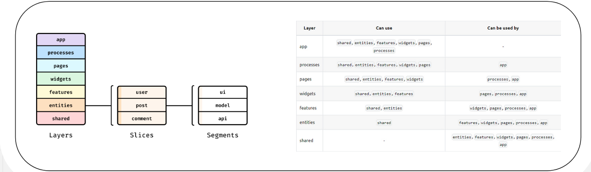

# Архитектура проекта

Для разработки функционала следует придерживаться архитектуре [Feature-Sliced Design](https://feature-sliced.design/)



```text
├── app/
| # Слой композиции приложения
| # Содержит только абстрактную логику инициализации и маршрутизации по приложению
| ├──router/
| | ├──Router
| # Содержит в себе логику маршрутизации
| ├──App
| # Содержит в себе обёртку для маршрутизации по приложению
| ├──index.css
| # Точка входа для Tailwind CSS и содержит глобальные стили проекта
|
├── pages/
| # Срезы, реализующие полные представления для этого приложения
| ├── LandingPage
| # Срез, содержащий в себе полное представление страницы для неавторизованных пользователей
| ├── AuthPage
| # Срез, содержащий в себе полное представление страницы для авторизации пользователя
| ├── FieldsPage
| # Срез, содержащий в себе полное представление страницы "Менеджмент полей"
| ├── ProfilePage
| # Срез, содержащий в себе полное представление страницы "Профиль"
| ├── PartPage
| # Срез, содержащий в себе полное представление страницы "Участка поля"
| ├── RecommendationPage
| # Срез, содержащий в себе полное представление страницы "Рекомендации"
| ├── NotFoundPage
| # Срез, содержащий в себе полное представление страницы "Ошибка 404"
|
├── widgets/
| # Срезы, реализующие различные комбинации абстрактных и/или бизнес-блоков с нижележащих слоёв,
| # для предоставления изолированных атомарных фрагментов пользовательского интерфейса
| ├── Login
| ├── Registration
| ├── Header
| ├── ActionField
|
├── features/
| # Срезы, реализующие пользовательские сценарии; обычно здесь приходится оперировать бизнес-объектами
| ├── CreateUser
| ├── SignIn
| ├── FieldExecutor
| ├── GetRecommendation
| ├── ToastExecutor
| ├── FetchHttpClient
|
├── entities/
| # Срезы, реализующие бизнес-блоки в терминах того, какая бизнес-логика приложения сработает
| ├── FieldInfo/
| | ├── ui/
| | # Содержит в себе UI-компоненты, применяемые только для этого компонента
| | ├── model/
| | # Содержит в себе сущности логики компонента
| | ├── api/
| | # Содержит в себе методы для взаимодествия с API
| | ├── index
| | # Срез, всех абстрактных блоков, находящихся в слайсе
| ├── Recommendation
| | ├── ui/
| | ├── model/
| | ├── api/
| | ├── index
| ├── ToastWrapper
| | ├── ui/
| | ├── model/
| | ├── api/
| | ├── index
|
├── shared/
| # Этот слой – набор абстрактных сегментов и общепереиспользуемых элементов
| # Это означает, что в нём допустимы какие-либо ui-элементы, кастомные библиотеки и любые блоки переиспользуемые по всему проекту
| | ├── ui/
| | # Содержит в себе переиспользуемые UI-элементы
| | | ├── Input/
| | | | ├── Input
| | | | # UI-элемент текстового поля
| | | | ├── Input.stories
| | | | # Импортирование UI-элемента в StoryBook
├── main
| # Точка входа в приложение
```

## Правила нейминга в коде 

| camelCase  |        PascalCase         |             kebab-case              |
|:----------:|:-------------------------:|:-----------------------------------:|
| Переменные | Функциональные компоненты | Переменные конфигурационных файлов  |
|   Методы   |          Классы           |                                     |
|  Функции   |                           |                                     |

*Хуки называть по правилам [React](https://react.dev/reference/react/hooks)<br/>
*Неупомянутые аспекты называть в соответствии с [AirBnb](https://github.com/airbnb/javascript)

## Правила нейминга в файловой системе

| camelCase |        PascalCase         |
|:---------:|:-------------------------:|
|   Слои    | Функциональные компоненты |
|  Слайсы   |          Классы           |
| Сегменты  |                           |

*Хуки называть по правилам [React](https://react.dev/reference/react/hooks)

## Внешние зависимости

### Маршрутизация проекта
- React Router

### Стилизация проекта
- Ant Design

### Работа с API
- RTK-Query

### Библиотеки для разработки собственной бибилиотеки UI-компонентов
- Ant Design
- Zod (Валидация форм)
- react-hook-form (Для обработки событий и взаимодействия с формами)

### Библиотеки для тестирования компонентов
- Storybook
- Jest

### Библиотеки для сборки проекта
- Vite

### CI/CD библиотеки
- Prettier (AirBnb)
- Eslint (AirBnb)

## Скрипты для запуска и тестирования
- ```npm run dev``` запуск в режиме разработчика
- ```npm run build``` cборка приложения
- ```npm run preview``` запуск в режиме production
- ```npm run sb``` запуск Storybook
- ```npm install``` для загрузки всех необходимых зависимостей
